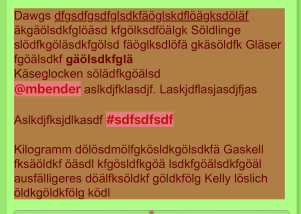
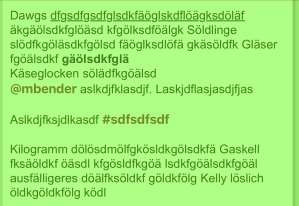
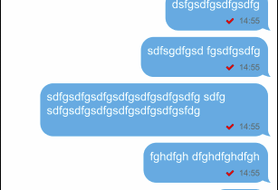
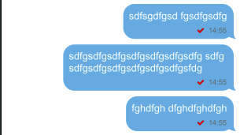

# ti.labelextension

## Description

TIUILabel Extension for iOS (Titanium Module)

Improves Label rendering perfomance about factor 10,
also no blended layers, improves also scroll perfromance in ListViews/ScrollViews/TableViews....

(https://medium.com/prolific-interactive/improving-user-interactions-via-instruments-63a7981f59eb)

Just add module in **tiapp.xml** no further steps needed!


API is exactly as:
https://titaniumsdk.com/api/titanium/ui/label.html

## additional property

* `calcRealSize` - BOOL true/false (defaults to false when not set) -- render the label to it´s real size, see example image

## Example images blended layers (without module / with module)
 

## Example images calcrealsize (calcrealsize false / calcrealsize true)
 


## Example

```js

var label1 = Ti.UI.createLabel({
  color: '#900',
  font: { fontSize:48 },
  shadowColor: '#aaa',
  shadowOffset: {x:5, y:5},
  shadowRadius: 3,
  text: 'A simple label',
  calcRealSize:true,
  textAlign: Ti.UI.TEXT_ALIGNMENT_CENTER,
  top: 30,
  width: Ti.UI.SIZE, height: Ti.UI.SIZE
});
```

