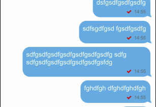
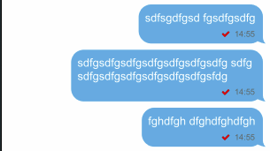
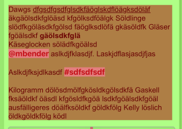
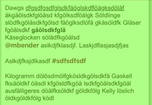

# ti.labelextension

**High-Performance UILabel Extension for Appcelerator Titanium on iOS**

Replaces the standard Titanium `UILabel` with an optimized implementation that eliminates blended layers, improves rendering performance by up to 10x, and dramatically improves scroll performance in `ListView`, `ScrollView`, and `TableView`.

---

## Why This Module?

Standard Titanium labels suffer from **blended layer** issues – the UILabel is rendered with a clear background and then composited by the GPU, which is expensive. This module:

- **Eliminates blended layers** by setting `opaque = YES` and `masksToBounds = YES`
- **Caches measurements** via `NSCache` to avoid redundant text layout calculations
- **Recycles TextKit objects** (NSLayoutManager, NSTextContainer) instead of reallocating them on every tap
- **Renders to real size** with `calcRealSize` for pixel-perfect auto-sizing
- **Supports attributed strings with link detection** via optimized TextKit hit-testing

> **Zero code changes required.** Simply add the module to your `tiapp.xml` and all existing labels automatically use the optimized implementation.

---

## Installation

Add the module to your `tiapp.xml`:

```xml
<modules>
    <module version="1.1.2">ti.labelextension</module>
</modules>
```

**That's it.** No further configuration needed. The module automatically intercepts and optimizes all `Ti.UI.createLabel` calls.

### Requirements

| Item | Value |
|------|-------|
| Platform | iOS (iPhone, iPad, Mac Catalyst) |
| Min SDK | 13.2.0 |
| Architectures | arm64, x86_64 (simulator) |
| API Version | 2 |

---

## Properties

All standard `Ti.UI.Label` properties are supported. See the [official Titanium API docs](https://docs.appcelerator.com/platform/latest/#!/api/Titanium.UI.Label).

### Module-Specific Properties

#### `calcRealSize` *(BOOL)*

Renders the label to its **actual text size** instead of the parent container's frame.

- **Default:** `false`
- **Use case:** Labels with `width: Ti.UI.SIZE` and `height: Ti.UI.SIZE` that should shrink-wrap their content precisely

```javascript
var label = Ti.UI.createLabel({
    text: 'Dynamic content',
    calcRealSize: true,
    width: Ti.UI.SIZE,
    height: Ti.UI.SIZE
});
```

**Without `calcRealSize`** (false):


**With `calcRealSize`** (true):


---

### Standard Titanium Label Properties (all supported)

#### Text & Font

| Property | Type | Description |
|----------|------|-------------|
| `text` | String | Label text content |
| `font` | Dictionary | Font settings: `{ fontFamily, fontSize, fontWeight }` |
| `color` | String | Text color (hex, rgb, named colors) |
| `textId` | String | Localization key (i18n) |
| `minimumFontSize` | Number | Minimum font size for auto-shrinking (`adjustsFontSizeToFitWidth`) |
| `maxLines` | Number | Maximum number of lines (0 = unlimited) |

#### Layout & Alignment

| Property | Type | Description |
|----------|------|-------------|
| `textAlign` | Number/Constant | `Ti.UI.TEXT_ALIGNMENT_LEFT`, `CENTER`, `RIGHT` |
| `verticalAlign` | String/Number | `'top'`, `'center'`, `'bottom'` (module-specific override) |
| `ellipsize` | String/Number | `'true'` for tail truncation, or `NSLineBreakMode` constant |
| `calcRealSize` | BOOL | Module-specific: render to actual text size |

#### Shadow

| Property | Type | Description |
|----------|------|-------------|
| `shadowColor` | String | Shadow color (hex, rgb) |
| `shadowOffset` | Dictionary | `{ x: Number, y: Number }` |

#### Background

| Property | Type | Description |
|----------|------|-------------|
| `backgroundColor` | String | Label background color |
| `backgroundImage` | String/Proxy | Background image |
| `backgroundPaddingLeft` | Number | Left padding for background image |
| `backgroundPaddingRight` | Number | Right padding for background image |
| `backgroundPaddingTop` | Number | Top padding for background image |
| `backgroundPaddingBottom` | Number | Bottom padding for background image |

#### Attributed String

| Property | Type | Description |
|----------|------|-------------|
| `attributedString` | Object | `Ti.UI.createAttributedString` or plain dictionary (SDK 14+) |
| `highlightedColor` | String | Text color when highlighted |
| `highlighted` | BOOL | Whether the label is highlighted |

---

## Events

All standard Titanium label events are supported:

| Event | Description |
|-------|-------------|
| `click` | Label was tapped |
| `singletap` | Single tap gesture |
| `doubletap` | Double tap gesture |
| `twofingertap` | Two-finger tap gesture |
| `touchstart` | Touch began |
| `link` | **Attributed string link tapped** (fires with `{ url, range }`) |

---

## Examples

### Basic Label

```javascript
var label = Ti.UI.createLabel({
    text: 'Hello World',
    font: { fontSize: 24, fontWeight: 'bold' },
    color: '#333',
    textAlign: Ti.UI.TEXT_ALIGNMENT_CENTER
});

win.add(label);
```

### Label with Shadow

```javascript
var label = Ti.UI.createLabel({
    text: 'Shadow Label',
    font: { fontSize: 36 },
    color: '#fff',
    shadowColor: '#000',
    shadowOffset: { x: 2, y: 2 },
    backgroundColor: 'rgba(0,0,0,0.1)'
});
```

### Auto-Shrinking Label (minimumFontSize)

The label will automatically shrink its font to fit the width.

```javascript
var label = Ti.UI.createLabel({
    text: 'This text will shrink to fit',
    font: { fontSize: 28 },
    minimumFontSize: 12,
    width: 200,
    height: 40
});
```

> **Note:** `minimumFontSize` values below 4 disable auto-shrinking and set `numberOfLines` to 0 (unlimited). Values of 4+ enable `adjustsFontSizeToFitWidth`.

### Dynamic Sizing with calcRealSize

For labels that should shrink-wrap their actual content:

```javascript
var label = Ti.UI.createLabel({
    text: 'Dynamic',
    calcRealSize: true,
    width: Ti.UI.SIZE,
    height: Ti.UI.SIZE
});
```

### Attributed String with Link Detection

```javascript
var label = Ti.UI.createLabel({
    attributedString: {
        text: 'Tap here to learn more',
        attributes: [{
            type: Ti.UI.ATTRIBUTE_LINK,
            value: 'https://example.com',
            range: [0, 22]
        }]
    },
    width: Ti.UI.SIZE,
    height: Ti.UI.SIZE
});

label.addEventListener('link', function(e) {
    Ti.API.info('Link tapped: ' + e.url);
    Ti.API.info('Range: [' + e.range[0] + ', ' + e.range[1] + ']');
});
```

### Rich Attributed String

```javascript
var label = Ti.UI.createLabel({
    attributedString: Ti.UI.createAttributedString({
        text: 'Bold and colored text',
        attributes: [
            {
                type: Ti.UI.ATTRIBUTE_FONT,
                value: { fontSize: 18, fontWeight: 'bold' },
                range: [0, 4]  // "Bold"
            },
            {
                type: Ti.UI.ATTRIBUTE_FOREGROUND_COLOR,
                value: '#e74c3c',
                range: [5, 12]  // "colored"
            }
        ]
    })
});
```

### Label in a ListView (Performance Use Case)

```javascript
var listView = Ti.UI.createListView({
    sections: [
        Ti.UI.createListSection({
            items: Array.from({ length: 100 }, (_, i) => ({
                template: 'itemTemplate',
                properties: {
                    titleText: 'Item ' + i,
                    titleFont: { fontSize: 16 }
                }
            }))
        })
    ]
});
```

> With `ti.labelextension`, scrolling this ListView is significantly smoother because blended layers are eliminated and measurements are cached.

---

## Performance

### Blended Layers

Blended layers occur when a view has a non-opaque background that the GPU must composite. This module eliminates them:

**Without module** (blended layer visible in Instruments):


**With module** (no blended layers):


### Caching Strategy

| Cache | Type | Purpose |
|-------|------|---------|
| **Measurement Cache** | `NSCache` (max 100 entries) | Caches text size calculations by width + font name + font size |
| **TextKit Stack** | NSLayoutManager, NSTextContainer, NSTextStorage | Cached per label for efficient link hit-testing on tap |
| **Frame Cache** | CGRect | Prevents unnecessary TextKit invalidation when frame hasn't changed |
| **Text Hash** | Number | Detects text changes to invalidate caches only when needed |

### What Happens on Property Changes

| Property Changed | Cache Action |
|-----------------|--------------|
| `text` | Clears measurement cache, resets text hash |
| `font` | Clears measurement cache (font affects size) |
| `frame` | Invalidates TextKit container (size/lineBreakMode updated) |
| `textAlign` | Triggers relayout via `padLabel` |

---

## Architecture

```
Ti.UI.createLabel()
    ↓
TiUILabelProxy (Extended)  ← Category on SDK proxy
    ↓
TiUILabel (Extended)       ← Category on SDK view
    ↓
UILabel                    ← Native iOS label
```

The module uses **Objective-C categories** to extend the SDK's `TiUILabel` and `TiUILabelProxy` without subclassing. This means:

- **Drop-in replacement** – no JS code changes needed
- **Compatible with all Titanium APIs** – every standard label property works
- **Safe upgrade path** – when Titanium SDK changes, the category adapts automatically

### Key Implementation Details

1. **Opaque rendering:** `label.opaque = YES` + `label.layer.masksToBounds = YES` prevents GPU compositing
2. **Center rounding:** `setCenter` floors to even integers, preventing sub-pixel blur
3. **Single-pass attribute optimization:** On tap, font and paragraphStyle attributes are added/merged in one enumeration pass
4. **TextKit recycling:** NSLayoutManager and NSTextContainer are reused across taps instead of reallocating

---

## Comparison: Standard Titanium vs ti.labelextension

| Feature | Titanium SDK | ti.labelextension |
|---------|-------------|-------------------|
| Blended layers | Yes | **No** (opaque rendering) |
| Measurement caching | None | **NSCache** (100 entries) |
| TextKit allocation | New per tap | **Cached & recycled** |
| calcRealSize | No | **Yes** |
| minimumFontSize binary search | Linear (O(n)) | **Binary search (O(log n))** |
| AttributedString from dict | SDK 14+ | **Yes** (fromProperties) |
| Link event | Yes | **Yes** (optimized) |

---

## Troubleshooting

### Label text appears cut off

This can happen with `calcRealSize: true` and very long text. Try:
- Setting an explicit `width` constraint
- Using `maxLines` to limit line count
- Setting `ellipsize: 'true'` for tail truncation

### Font size doesn't shrink with minimumFontSize

- Values **below 4** disable auto-shrinking (Titanium legacy behavior)
- Values **4+** enable `adjustsFontSizeToFitWidth` with `minimumScaleFactor`
- If `maxLines` is set, shrinking is limited to that number of lines

### Attributed string links don't fire

- Ensure the label has a `link` event listener before adding it to the view
- The label must have `userInteractionEnabled` (default for labels with listeners)
- Check that the attributed string has a valid `type: Ti.UI.ATTRIBUTE_LINK` attribute

---

## License

Copyright © 2022-2026. All rights reserved.

---

## Author

**Marc Bender** — [Titanium Developer](https://github.com/funkyboyde)

---

## Changelog

### 1.1.2 (current)
- Measurement cache: store CGSize via NSValue (fixes lost height bug)
- TextKit stack recycling instead of reallocating
- `fromProperties` for AttributedString (SDK 14+ dict support)
- Optimized recognizedTap: skip empty label processing
- needsParentRefresh flag reset after parent refresh

### 1.1.1
- Binary search for minimumFontSize (O(log n) instead of O(n))
- Single-pass enumerateAttributes optimization
- Clean label initialization (no blended layers from the start)

### 1.1.0
- Initial release with blended layer elimination
- calcRealSize property
- Measurement caching with NSCache
